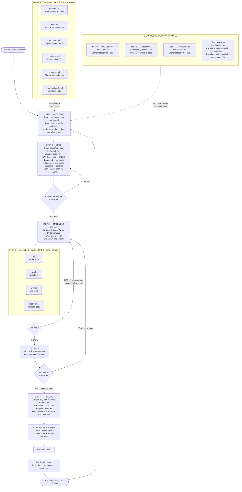
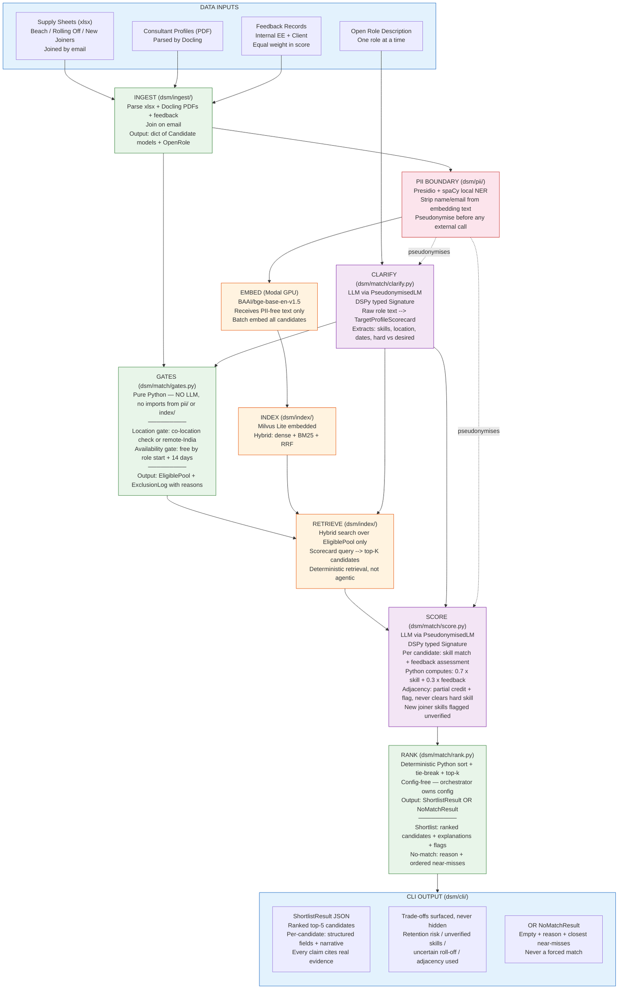

# Staffer — Demand–Supply Matcher

A staffing decision engine: given one open role, returns a ranked, explainable shortlist of consultants with trade-offs surfaced for a human to decide.

## Quick start

### Prerequisites

- Python 3.12+
- [uv](https://docs.astral.sh/uv/) (package manager)
- Docker (optional)

### Local setup

```bash
git clone https://github.com/shreyabaid007/staffer.git
cd staffer

# Install dependencies
uv sync --dev

# Copy and fill in API keys
cp .env.example .env

# Run the harness
make check
```

### Docker setup

```bash
cp .env.example .env   # fill in API keys

# Production
docker compose up app

# Dev (run tests, lint, typecheck)
docker compose run dev make check
```

### Makefile targets

| Command         | What it does                          |
| --------------- | ------------------------------------- |
| `make check`    | format + lint + typecheck + test + eval |
| `make format`   | ruff format                           |
| `make lint`     | ruff check --fix                      |
| `make typecheck`| pyright                               |
| `make test`     | pytest tests/ -v                      |
| `make docker`   | build prod image                      |
| `make docker-dev`| build dev image                      |

## Docs

- [Product](docs/product.md) — what we're building and why
- [Tech](docs/tech.md) — stack, rules, architecture
- [Structure](docs/structure.md) — repo layout and module contracts
- [Decisions](docs/decision.md) — ADRs
- [Progress](docs/progress.md) — current state of the build


## Quick Diagrams

### How We Build Features (spec-driven, harness-verified, lane-parallel)



### Data Pipeline



