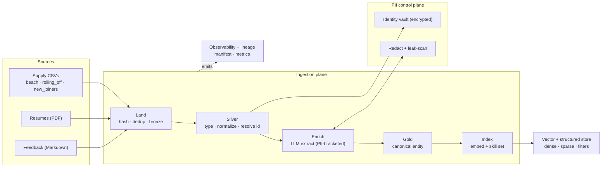
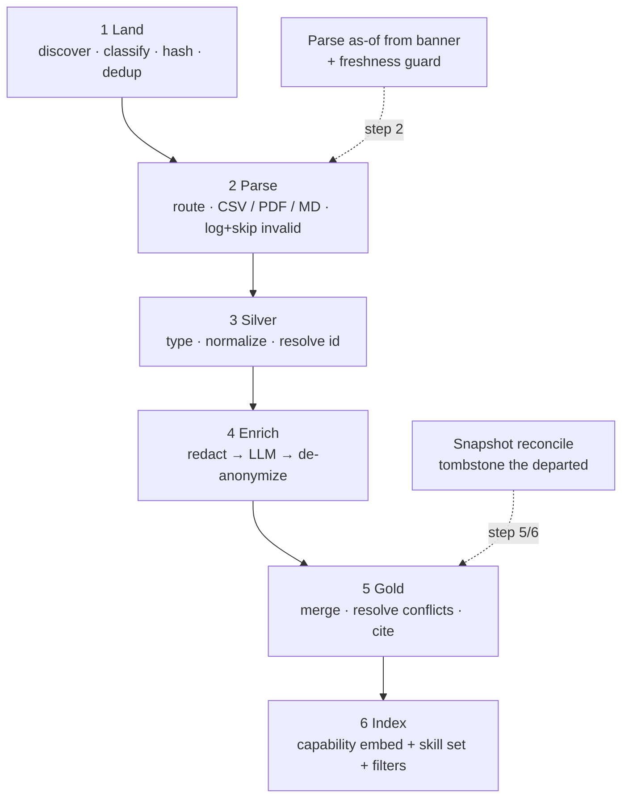
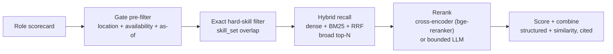
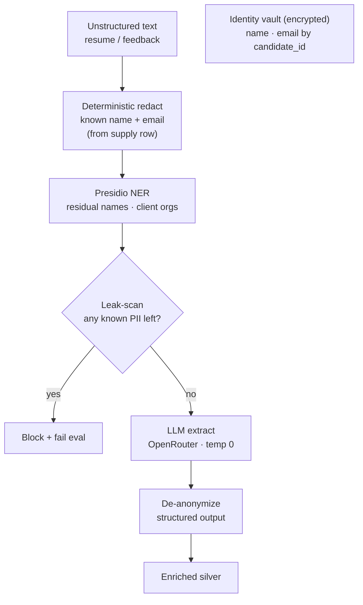
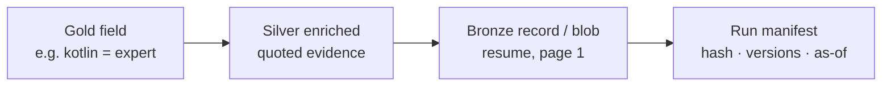

# Ingestion Architecture — EE Staffing Matching System

> **Scope:** the ingestion subsystem only — from raw source files to one query-ready **canonical candidate entity** per consultant, plus the embedding written at ingest time. Query-time scoring/ranking is downstream; the reranking stage is specified here only because it pairs with the embedding.
>
> Companion to the system PRD. This document covers ingestion components, the layered data flow, the **data model at each phase**, the canonical-entity merge, the index/embedding design, the PII boundary, and the correctness safeguards.

---

## 1. Design principles

1. **AI only where necessary.** CSV data is structured and **never** touches an LLM. LLMs are reserved for genuine language understanding: extracting structured signals from PDF profiles and from feedback markdown. Everything else (type coercion, normalization, identity resolution, merge, scoring) is deterministic code.
2. **Layered and immutable.** Three physical layers — **bronze** (raw, verbatim), **silver** (typed, normalized, per-source), **gold** (one merged canonical entity). Each is immutable once written and addressed by content hash. Replay always runs from bronze, never by re-reading the original source.
3. **Paradigm-neutral entity, opinionated index.** The gold entity carries no assumption about how it will be queried. The index built on top of it is opinionated: a capability embedding for fuzzy recall plus a structured skill set for exact matching.
4. **Validate, log, skip — never silently wrong.** A record that fails validation is logged (with reason and payload) and skipped, and the skip is counted in metrics. Nothing malformed passes silently; nothing valid is dropped.
5. **Determinism by default.** Same inputs + same derivation versions → byte-identical output. The cache — not the model — is the source of truth for reproducibility. Merge inputs are deterministically ordered.
6. **PII clean-by-construction, defense in depth.** Identity is redacted before any external call: known identifiers first, NER for the residual, an outbound leak-scan as a hard gate. Embedded text is PII-free by construction.
7. **Current-state correct.** Supply files are full snapshots. Each run reconciles against the previous known set and tombstones consultants who have disappeared. Availability is time-relative and stamped with its as-of date.

---

## 2. High-level components



---

## 3. Data sources

| Source | Format | Maps to | Notes |
|---|---|---|---|
| `data/raw/supply/beach.csv` | CSV (full snapshot) | `Candidate`, availability = `FreeNow` | `Days on Beach` column; available immediately |
| `data/raw/supply/rolling_off.csv` | CSV (full snapshot) | `Candidate`, availability = `RollingOff` | `Roll-off Date` + `Confidence`; date is time-relative |
| `data/raw/supply/new_joiners.csv` | CSV (full snapshot) | `Candidate`, availability = `NewJoiner` | `Join Date`; skills CV-derived → flagged `unverified` |
| `data/raw/resumes/*.pdf` | PDF | enriches skills + proficiency, projects, domain, seniority | Each format differs; Docling → redact → LLM → `ProfileSummaryExtraction` |
| `data/raw/feedback/*.md` | Markdown | populates `FeedbackSignals`, `performance_feedback_score` | Keyed by email; multiple items per consultant; new joiners have none |

**Identity and joins.** Email is the **identity, dedup, and join key**, tokenized to a stable `candidate_id` (HMAC). **Name is never a join key** — the corpus contains colliding first names (multiple *Aarav*, *Vikram*, *Deepak*). Resumes and feedback join to a consultant by the email they contain.

**Snapshot semantics.** The supply CSVs are *full snapshots* (the banner reads `as of <date>`). That date is **parsed, not discarded** — it stamps `valid_as_of` and drives the freshness guard (§10). The sheet a row appears in is the discriminator for `AvailabilityState`; a consultant can move between sheets across snapshots, and the latest snapshot is authoritative for supply state.

`Candidate` here is the enriched canonical entity (≈ the PRD's `ConsultantProfile` after PDF + feedback enrichment).

---

## 4. Storage model (bronze / silver / gold)

Plain files on local disk, content-addressed; no database for raw bytes. Layers reached through interfaces so the backend is swappable.

```
data/
  raw/
    supply/{beach,rolling_off,new_joiners}.csv
    resumes/*.pdf
    feedback/*.md
  bronze/
    blobs/sha256/<hash>          # verbatim bytes, immutable — PII-dense → encrypted + gitignored
    records/<hash>.jsonl         # rows as read: verbatim strings, zero normalization
    manifest.jsonl               # append-only landing log (also the crash-recovery commit marker)
  silver/                        # typed, normalized, identity-resolved — per source
  gold/<candidate_id>.json       # one canonical entity per consultant
  .cache/                        # derivation cache, keyed on (content_hash, version)
```

| Interface | Methods | MVP backend | Later swap |
|---|---|---|---|
| `BlobStore` | `put` · `get` · `exists` (by hash) | Local filesystem | Object storage (encryption + IAM = PII-at-rest) |
| `Manifest` | `append` · `has_hash` · `entries_for_run` | JSONL | SQLite (when the catalog needs queries) |

---

## 5. Ingestion flow

Pre-computes everything that does not depend on a role, so the query path stays cheap. Each stage has one typed input and one typed output.

| Step | Name | Input | Output | LLM? |
|---|---|---|---|---|
| 1 | **Land** | Raw files | `ManifestEntry` + bronze blob | No |
| 2 | **Parse** | Bronze blob | `list[BronzeRecord]` | No |
| 3 | **Silver** | `BronzeRecord` | `NormalizedRecord` | No |
| 4 | **Enrich** | `NormalizedRecord` (resume/feedback text) | `ProfileSummaryExtraction` · `FeedbackSignals` | **Yes** (PII-bracketed) |
| 5 | **Gold** | All silver for one `candidate_id` | `Candidate` (cited, conflicts resolved) | No |
| 6 | **Index** | `Candidate` | `CandidateIndexRecord` (embed + skill set + filters) | No (embed model only) |



Per-step behaviour is defined by the models in §6; the only non-obvious rule is that **invalid records are logged and skipped (counted in metrics), never quarantined or silently passed.**

---

## 6. Data models by phase

Pydantic v2; `frozen=True` where immutable semantics are wanted. Shared enums first.

```python
from enum import Enum
from datetime import date, datetime
from typing import Annotated, Generic, Literal, TypeVar
from pydantic import BaseModel, Field

class SourceType(str, Enum):
    SUPPLY_BEACH = "supply_beach"
    SUPPLY_ROLLING_OFF = "supply_rolling_off"
    SUPPLY_NEW_JOINERS = "supply_new_joiners"
    RESUME = "resume"
    FEEDBACK = "feedback"

class Grade(str, Enum):
    SENIOR_CONSULTANT = "senior_consultant"
    LEAD_CONSULTANT = "lead_consultant"
    PRINCIPAL_CONSULTANT = "principal_consultant"

class ProficiencyLevel(str, Enum):
    BEGINNER = "beginner"; INTERMEDIATE = "intermediate"
    ADVANCED = "advanced"; EXPERT = "expert"

class Confidence(str, Enum):
    LOW = "low"; MEDIUM = "medium"; HIGH = "high"
```

### Phase 1 — Land → `ManifestEntry`

```python
class LandingStatus(str, Enum):
    LANDED = "landed"        # new bytes, stored
    SKIPPED = "skipped"      # content hash already seen (idempotent no-op)
    INVALID = "invalid"      # could not classify or read

class ManifestEntry(BaseModel):
    run_id: str
    source_uri: str
    source_type: SourceType
    raw_bytes_hash: str               # "sha256:..."
    size_bytes: int
    discovered_at: datetime
    snapshot_date: date | None = None # parsed from CSV banner; None for pdf/md
    status: LandingStatus
```

### Phase 2 — Parse → `BronzeRecord`

```python
class BronzeRecord(BaseModel):
    source_hash: str
    source_type: SourceType
    row_index: int
    # CSV: original column names → string values, verbatim.
    # Resume: {"text": str, "sections": [str, ...], "email_found": str}.
    # Feedback: {"email_key": str, "raw_markdown": str, "kind": "project|client"}.
    raw: dict[str, str | list[str]]
```

### Phase 3 — Silver → `NormalizedRecord` (+ typed sub-models)

```python
class Skill(BaseModel):
    name: str                                   # canonical taxonomy id, e.g. "kotlin"
    proficiency: ProficiencyLevel | None = None
    unmapped: bool = False                       # raw skill not found in taxonomy

class Location(BaseModel):
    city: str | None                             # None when "Remote (India)"
    remote_eligible: bool = False                # Chennai-open / open-to-relocate (overloaded — see §15)

class FreeNow(BaseModel):
    type: Literal["free_now"] = "free_now"

class RollingOff(BaseModel):
    type: Literal["rolling_off"] = "rolling_off"
    expected_date: date
    confidence: Confidence                       # a flag, not a gate

class NewJoiner(BaseModel):
    type: Literal["new_joiner"] = "new_joiner"
    join_date: date

AvailabilityState = Annotated[
    FreeNow | RollingOff | NewJoiner, Field(discriminator="type")
]

class NormalizedRecord(BaseModel):
    candidate_id: str                            # HMAC(email); never the raw email
    source_type: SourceType
    source_hash: str
    valid_as_of: date | None = None              # from the snapshot banner
    grade: Grade | None = None
    location: Location | None = None
    availability: AvailabilityState | None = None
    skills: list[Skill] = []
    raw_text: str | None = None                  # resume body / feedback item → enrichment
    parse_warnings: list[str] = []               # e.g. lossy Chennai-open → remote_eligible mapping
    extractor_version: str
```

### Phase 4 — Enrich (LLM output schemas)

Every extracted fact carries an `EvidenceCitation`; the `quote` is verified to exist in the source before the extraction is accepted.

```python
class EvidenceCitation(BaseModel):
    source_hash: str
    locator: str            # e.g. "resume p1 SKILLS" | "feedback fb_0"
    quote: str              # verbatim span, verified present in source

class SkillExtraction(BaseModel):
    name: str                                    # surface form, pre-normalization
    proficiency: ProficiencyLevel | None = None
    evidence: EvidenceCitation

class ProfileSummaryExtraction(BaseModel):       # resume LLM output
    skills: list[SkillExtraction]
    employers: list[str]
    projects: list[str]
    domains: list[str]
    seniority_signals: list[str]
    education: list[str]

class FeedbackSignals(BaseModel):                # per feedback item, later aggregated
    confirmed_skills: list[str]
    skill_gaps: list[str]
    domain_confirmation: str | None = None
    sentiment: Literal["very_positive", "positive", "neutral", "negative"]
    retention_requested: bool = False            # PRD §3.4 modifier (+0.15)
    rejection_requested: bool = False            # PRD §3.4 modifier (-0.25, never decayed)
    summary: str
    evidence: EvidenceCitation
```

`performance_feedback_score` is computed deterministically from aggregated `FeedbackSignals` (PRD §3.4 recency-decay + modifiers) — not emitted by the LLM.

### Phase 5 — Gold → `Candidate` (canonical, sourced)

```python
T = TypeVar("T")

class Sourced(BaseModel, Generic[T]):
    value: T
    citations: list[EvidenceCitation]
    confidence: Confidence = Confidence.MEDIUM

class MergedSkill(BaseModel):
    name: str
    proficiency: ProficiencyLevel | None = None
    demonstrated: bool | None = None             # feedback-verified; None = unverified
    confidence: Confidence
    citations: list[EvidenceCitation]
    conflict: str | None = None                  # set when resume vs feedback disagree

class Candidate(BaseModel):                       # ≈ PRD ConsultantProfile, enriched
    candidate_id: str
    name_vault_ref: str                           # pointer into the encrypted vault
    email_vault_ref: str
    grade: Sourced[Grade]
    location: Sourced[Location]
    availability: Sourced[AvailabilityState]
    skills: list[MergedSkill]
    domains: list[Sourced[str]]
    projects: list[str]
    feedback_signals: FeedbackSignals | None = None
    performance_feedback_score: float | None = None   # None → 0.50 at scoring time
    valid_as_of: date | None = None
    is_tombstoned: bool = False                   # set by snapshot reconciliation
    conflicts: list[str] = []
    gold_hash: str                                # change-detection for re-index
    merge_version: str
```

### Phase 6 — Index → `CandidateIndexRecord`

```python
class CandidateIndexRecord(BaseModel):
    candidate_id: str
    embed_text: str               # capability-only, PII-free passage (the embedded text)
    dense_vector: list[float]     # e.g. 768-dim
    skill_set: list[str]          # exact-match + BM25 sparse side (hard-skill matching)
    # filter metadata — pre-filters, NOT embedded:
    grade: Grade
    city: str | None
    remote_eligible: bool
    availability_type: Literal["free_now", "rolling_off", "new_joiner"]
    availability_date: date | None
    valid_as_of: date | None
    gold_hash: str
```

---

## 7. Canonical candidate entity & merge

Provenance-weighted merge — never a blind union or average.

| Field | Authority | Rationale |
|---|---|---|
| Grade · location · availability | Latest **supply snapshot** | Operational system of record |
| Skill *names* | Union of all sources | Widest recall |
| Skill *proficiency* | Resume > CSV | CSV carries no proficiency |
| Skill *truth* (`demonstrated`) | **Feedback > resume** | Verified engagement beats self-report |
| Domain | Resume claim; feedback-confirmed = higher confidence | Corroboration raises confidence |
| Projects | Resume (enriched) | Only source of project detail |
| Feedback signals | Feedback | Only source; surfaced as a flag, never a silent down-rank |

**Conflict resolution — worked example.** A resume claims *"built infrastructure-as-code"* at three employers; the feedback says *"has not worked with Terraform/IaC."* Feedback wins for skill truth: `terraform.demonstrated = false`, **both** citations attached, the conflict **recorded** — never averaged. If a role hard-requires Terraform, the consultant fails on real evidence, with a rationale that shows why.

Profile shapes the index must tolerate: *rich* (CSV + resume + feedback), *medium* (CSV + resume), *thin* (CSV only — `proficiency` null, `demonstrated` null, `unverified`). A thin entity still works; it just ranks lower on confidence. **Partial is always better than absent.**

---

## 8. Index & embedding (and the retrieval handoff)

The embedding is written at **ingest time** (phase 6); reranking is a **query-time** stage, specified here because it pairs with the embedding.

### What gets embedded

A **capability-only passage** built from gold:

- **Include:** skills + proficiency, domains, project descriptions, seniority *evidence* (years, led delivery, scale).
- **Exclude:** name, email, client org names, `candidate_id`; status/availability; grade *as a label*; and **negations/absences** — `terraform` simply does not appear in the text. Absence is handled structurally by `skill_set` + `MergedSkill.demonstrated`, because embeddings cannot represent negation.

Example (`embed_text`): `Backend engineering specialist, payments domain, lead-level seniority. kotlin expert. java expert. spring boot expert. kafka. aws. Re-architected a card-authorization service in kotlin. Hardened a high-scale reporting service serving over a million users. Led delivery, owned architecture, ran incident response.`

### Embedding model and formatting

- **Model:** an instruction-tuned retrieval model — recommended default **`BAAI/bge-base-en-v1.5`** (768-dim, small, locally hostable in embedded Milvus). The architecture is model-agnostic; the leaderboard moves fast, so this is a swappable choice.
- **Asymmetric formatting:** embed the candidate as a *passage*; embed the role/scorecard as a *query* using the model's query instruction prefix. Skipping this quietly costs recall.
- **Contextual prefix** (Anthropic's Contextual Retrieval pattern): prepend a one-line context to each passage so thin profiles are not ambiguous out of context.

### Exact vs fuzzy

- **Dense vector** → fuzzy adjacency (similar skills/roles) only.
- **`skill_set` (structured + BM25 sparse)** → exact hard-skill matching and rare tech terms (`dbt`, `CKA`, `scikit-learn`) that dense models tokenize poorly. A stated **hard skill is matched here, never by cosine similarity.**

### Retrieval handoff (query-time, serving)



**Reranking is the precision lever the PRD's raw `0.6 × similarity` lacks.** First stage gets broad recall cheaply; a cross-encoder (recommended default **`BAAI/bge-reranker-base`**) or a single bounded LLM rerank re-scores each role–candidate pair *jointly* for a precise top-k, which then feeds the structured combine. At current scale the eligible pool is small enough to rerank in full.

---

## 9. PII boundary

Redact-at-ingest, clean-by-construction, defense in depth. No serving module imports Presidio for profile text.



The key move: the identifiers are already known (name + email come from the supply row), so they are redacted **deterministically first**; NER handles only residual unknowns and client org names; an **outbound leak-scan** blocks any text still containing a known PII string and fails the build. This does not rely on NER being perfect — important for Indian surnames and org names that read as ordinary words.

| Field | Class | At ingestion | To LLM / embed | Retain |
|---|---|---|---|---|
| Email | Direct ID + join key | Hash → `candidate_id` | Never | Vault, retention-limited |
| Name | Direct ID | Strip from derived text | Never | Vault |
| Client org | Sensitive | Tokenize before LLM | Never in embed text | Yes |
| Location / Chennai-open | Quasi | Normalize | OK (match signal) | Yes |
| Skills · grade · dates | Non-PII | Normalize | OK | Yes |
| Resume / feedback text | PII-dense | Anonymize before extract | Only anonymized | Bronze (encrypted), retention-limited |

PII scope: name, email, phone, address, national ID, date of birth, plus client org names.

---

## 10. Correctness safeguards

| Safeguard | Prevents | Mechanism |
|---|---|---|
| **Snapshot reconciliation + tombstones** | Stale ghost candidates; sheet-move staleness | Each run, diff the current `candidate_id` set vs the prior set; tombstone the departed; latest snapshot wins for supply state |
| **As-of validity + freshness guard** | Matching against time-expired availability | Parse the snapshot date from the banner; stamp `valid_as_of`; warn/refuse when the snapshot is stale vs a role's start |
| **Deterministic redact + leak-scan** | PII leak via imperfect NER | Redact known identifiers first; NER the residual; outbound scan blocks + fails eval |
| **Evidence as quoted text + verify** | Rotted offsets; fabricated citations | Store the quoted span; reject any claim whose quote is not found in the source |
| **Commit markers + atomic writes** | Half-written state after a crash | Write blob → append manifest (commit); derived files to temp + atomic rename; stages resumable |
| **Determinism** | Non-reproducible extraction / merge | Cache is source of truth; pinned model version *is* a derivation version; merge inputs sorted |
| **Quality observability + `explain` + golden tests** | Silent quality decay; undiagnosable regressions | Quality metrics; `explain <candidate>` lineage dump; ingestion golden tests with recorded LLM responses (cassettes) |

---

## 11. Reprocessing & replay

- **Replay from bronze, never from the source** — a moved/deleted source file cannot break reproducibility.
- **Versioned derivations.** Silver carries `extractor_version`; enrichment is keyed on `(bronze_hash, prompt_version, model_version)`. A **model-version change is a version bump** (re-extract + re-eval), never silent drift.
- **Scoped re-merge / re-index.** A taxonomy change touches everyone; a corrected resume touches one `candidate_id`. The `gold_hash` gates re-embedding so only changed entities are re-vectorized.
- **One command.** `reprocess --from <layer> --version X` — idempotent and observable.

---

## 12. Observability & lineage

A gold field that cannot name its source does not exist.



**Run manifest:** run_id, trigger, files seen + hashes, counts (landed / skipped / invalid / tombstoned), all derivation versions, per-stage timing.

**Quality metrics** (catch decay, not just volume): extraction coverage, unmapped-skill rate trend, conflict rate, leak-scan hits, citation-verification failures, snapshot freshness, tombstones per run, **skip/invalid rate**.

**Invalid records:** logged via structlog with reason + payload + run_id, skipped, counted — never silently passed.

---

## 13. Module layout

Flat-ish `ingest/`, one concern per file, no imports from the serving/matcher layer (enforced in CI).

```
ingest/
  land.py        discover · classify · hash · dedup · write bronze + manifest
  parse/
    csv.py        banner + as-of · per-sheet headers · quoting · log+skip
    pdf.py        Docling · sections · OCR fallback · log+skip
    markdown.py   email key · split feedback items
  silver.py      type coercion · normalization · identity resolution
  taxonomy.py    skill / title / domain canonical maps · unmapped queue
  enrich.py      anonymize → LLM extract → de-anonymize · cached · versioned
  merge.py       silver → gold · authority rules · conflict resolution
  reconcile.py   snapshot diff · tombstones · latest-snapshot-wins
  index.py       build embed_text · embed · skill_set · upsert
  blobstore.py   BlobStore protocol + LocalFS / object-store impls
  manifest.py    Manifest protocol + JSONL / SQLite impls
  lineage.py     run manifest · per-record lineage · metrics
  pii/
    redact.py     deterministic redaction + Presidio residual
    leakscan.py   outbound known-PII gate
    vault.py      encrypted email ↔ candidate_id store
  models.py      all phase models from §6
  prompts/       versioned templates: profile_extraction · feedback_extraction
```

---

## 14. Tech stack

| Component | Technology | Role |
|---|---|---|
| Environment | Python, uv, mise | Reproducible env and deps |
| Data models | Pydantic v2 | Typed validation at every boundary |
| Document parsing | Docling | PDF → section-tagged text |
| PII | Presidio + deterministic redaction + outbound leak-scan | Clean-by-construction, defense in depth |
| LLM calls | OpenRouter; versioned prompts; `temperature=0`; cached | Enrichment only (PDF + feedback) |
| Embeddings | `BAAI/bge-base-en-v1.5` (sentence-transformers); instruction-prefixed | Capability vector at ingest |
| Reranker | `BAAI/bge-reranker-base` (or bounded LLM) | Query-time precision stage |
| Vector + structured store | Milvus Lite (embedded) | Dense + BM25 + RRF, with filter metadata |
| Blob store | Content-addressed: local FS → object storage | Verbatim bronze bytes |
| Manifest / catalog | JSONL → SQLite | Landing log + lineage |
| Derivation cache | Content + version keyed | Determinism + cheap replay |
| Logging | structlog | Shared-schema JSON logs |
| Evaluation | Golden fixtures + recorded LLM cassettes (Promptfoo / DeepEval) | Deterministic ingestion tests; CI gate |

---

## 15. Open questions

1. **Embedding model choice** is pinned to `bge-base-en-v1.5` as a proven default, but the embedding-model landscape moves fast. Confirm or pull the current leaderboard before locking it; the architecture is model-agnostic either way.
2. **Structured-only viability.** At current scale (eligible pools of single-digits to dozens after gates) exhaustive structured scoring without a vector recall stage is viable and more explainable; the vector path earns its keep once eligible-pool size × per-candidate LLM-score cost grows painful. Decide whether to ship the vector path now or defer it behind the index interface.
3. **Location overloading.** `Chennai-open`, `Location = "Remote (India)"`, and `remote_eligible` collapse three distinct concepts. Proposal: split into `home_location` / `onsite_open_cities` / `remote_within_country`. Needs a model decision.
4. **Org-name anonymization.** Presidio will not reliably catch client names (e.g. *Meridian Pay*, *Cobalt Capital*). Maintain a dictionary, accept residual risk, or both?
5. **Erasure path timing.** Purge-by-`candidate_id` (tombstone + vault purge + blob purge + retention window) is designed. Implement up front, or on first real erasure need?
6. **Taxonomy ownership.** Who owns alias additions and reviews the unmapped-skill queue.
