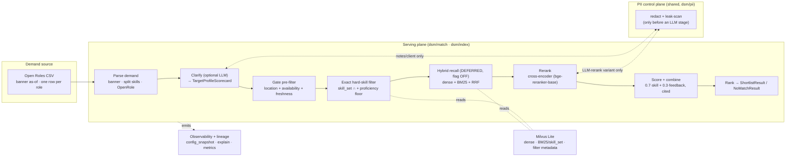
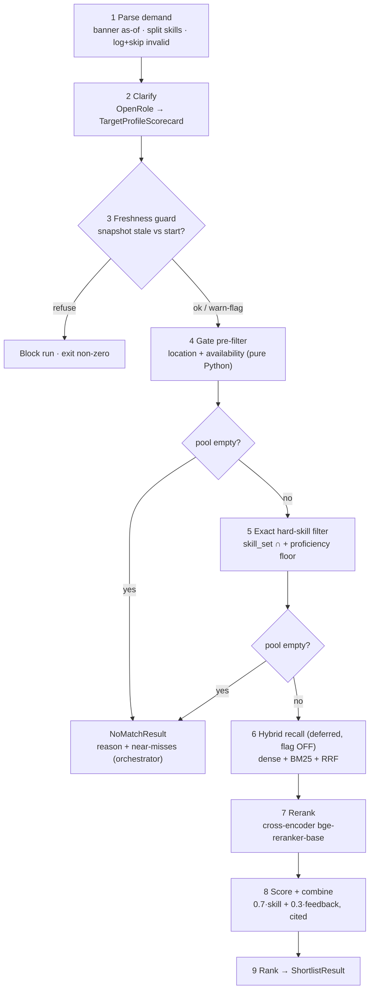
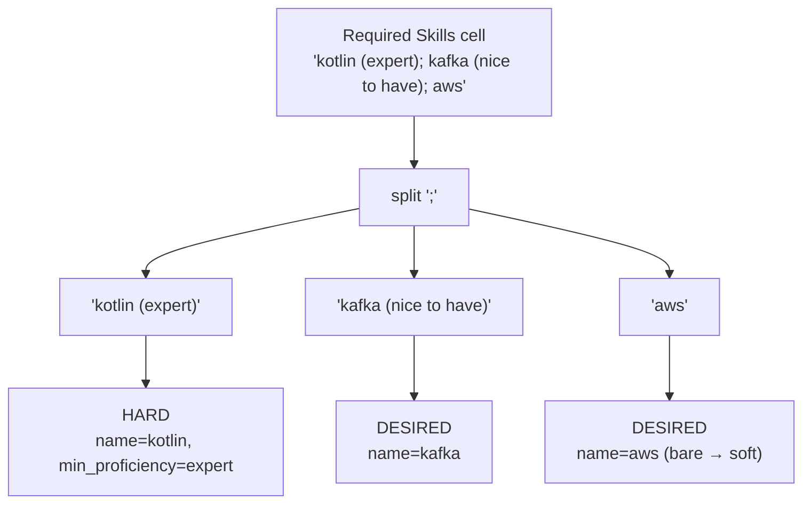
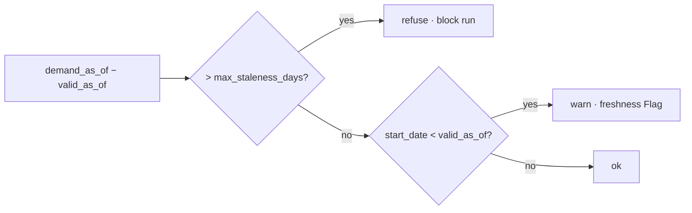
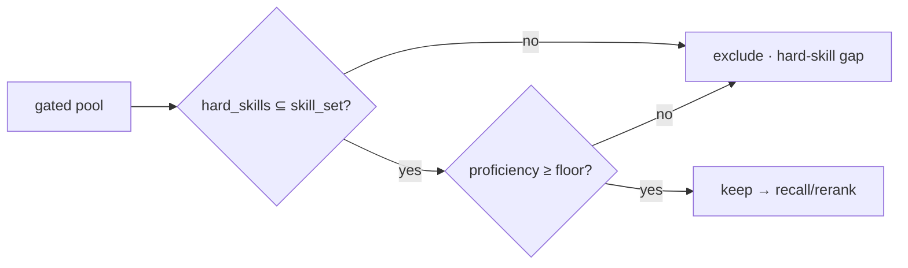
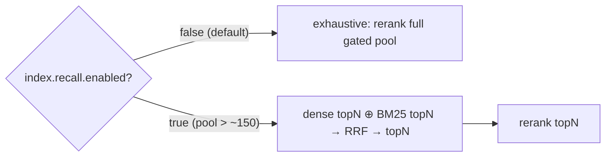
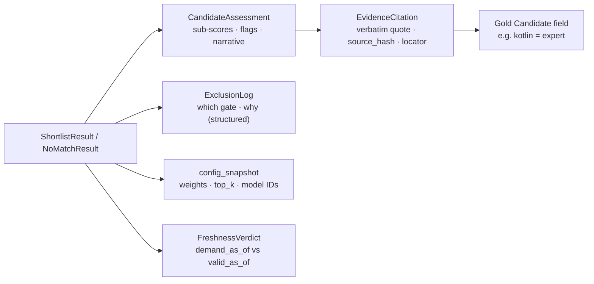

# Query-Time (Serving) Architecture — EE Staffing Matching System

> **Scope:** the query-time subsystem only — from a raw demand-side **Open Roles CSV** to a
> ranked, explainable **shortlist of consultants per role**, with the trade-offs surfaced for a
> human to decide. This is the full expansion of ingestion **§8 "Retrieval handoff (query-time,
> serving)"** — the five-stage spine `Gate pre-filter → exact hard-skill filter → hybrid recall →
> rerank → score + combine`.
>
> **Companion to `ee-ingestion-architecture.md`.** That document is the authoritative upstream
> contract; this one consumes it and **must not contradict it**. Where ingestion already fixes a
> contract (the `CandidateIndexRecord` facet split, the PII control plane, the Milvus store, the
> canonical `Candidate`), this doc **consumes** it — it does not redefine it.
>
> **Status:** design doc, analogous to the ingestion architecture (which was ratified as
> AD-065…AD-074). It **proposes** four query-time ADRs — **AD-081 … AD-084** (collected in §13) —
> two of which (AD-081 location split, AD-084 freshness thresholds) touch frozen / shared
> contracts and therefore **require team sign-off before any implementation** (AD-060). Nothing
> here is built yet; the Pydantic models are illustrative interface definitions.

---

## 1. Design principles

Carried over from ingestion §1, specialised for serving:

1. **AI only where necessary.** The demand CSV is structured and **never** touches an LLM. Gates,
   the exact hard-skill filter, date arithmetic, RRF fusion, and the structured score combine are
   **deterministic Python**. LLMs are reserved for two bounded, optional jobs: scorecard
   construction from free-text `Notes/Constraints` (clarify) and the LLM-rerank *variant*. The
   default reranker is a Modal cross-encoder — **not** an LLM (AD-071).
2. **Validate, log, skip — never silently wrong.** A demand row that fails validation is logged
   (reason + payload) and skipped, and the skip is counted. A role that survives parse but matches
   nobody returns an explicit **no-match** result, never a forced or fabricated match
   (product invariant; AD-041).
3. **Gates are deterministic and LLM-free.** Location + availability eligibility is pure Python
   over Pydantic models; an LLM can never decide eligibility, never override a gate (AD-002).
   Nothing ranks above a candidate who fails a gate.
4. **Determinism by default.** Same Open Roles CSV + same supply snapshot + same config/model
   versions → byte-identical shortlist. `temperature=0` on every LLM call; deterministic sort and
   tie-break (`dsm/match/rank.py`); RRF and the exact filter are pure functions.
5. **PII clean-by-construction.** Structured demand columns carry no candidate PII and never reach
   an LLM, so they need no redaction (golden rule 3). Free-text `Notes/Constraints` and the
   `Client` org name are the only demand-side PII surfaces, and they are redacted through the
   **shared ingestion PII control plane** (`dsm/pii/`) *only* before an LLM stage (§7).
6. **Every claim cites real evidence.** Each line of the shortlist reuses `EvidenceCitation`
   (AD-040/073) — a verbatim quote verified present in the source. No unsourced assertions; the
   two-tier "shown, not hidden" framing of trade-offs is carried by `Flag`s, never silent
   re-ranking.
7. **Explainable end to end.** Any role → shortlist (or no-match) decomposes into: which gate each
   candidate passed/failed and why, which hard skills matched structurally, the rerank order, the
   structured sub-scores, and the citations behind every claim (§9).

---

## 2. High-level components



The ingestion plane writes the `Candidate` gold entities and the `CandidateIndexRecord`s into
Milvus. The serving plane is **read-only** over that store and **must not import `dsm/ingest/`**
(§10). The dense-recall stage is fully specified but **OFF by default** (AD-082, §6.5).

---

## 3. Demand source

| Source | Format | Maps to | Notes |
|---|---|---|---|
| `data/raw/demand/open_roles.csv` | CSV (full snapshot) | one `OpenRole` per row | Banner `Open Roles - … - as of <date>` parsed into `demand_as_of` (drives the freshness guard, §6.3, exactly as the supply snapshot date does in ingestion §10). One row = one role; batch over the file. |

**Columns** (per the input contract): `Role ID`, `Title`, `Client`, `Sector`, `Required Skills`,
`Start`, `Location`, `Co-location`, `Priority`, `Notes / Constraints`.

**`Required Skills` is semicolon-delimited with two deterministic encodings** (split in pure
Python, never by an LLM):

| Surface form | Meaning | Routed to |
|---|---|---|
| `"<skill> (expert\|advanced\|intermediate\|beginner)"` | **HARD** requirement (`SkillDepth.HARD`) + a `min_proficiency` floor | `skill_set` **exact** membership + proficiency floor — **never cosine** (AD-033/072, mirrors §8) |
| `"<skill> (nice to have)"` or bare `"<skill>"` | **SOFT** signal (`SkillDepth.DESIRED`) | dense recall (when enabled) + desired-skill coverage + adjacency partial credit (AD-035) |

**`Co-location = Yes`** → hard **onsite** gate at `Location`'s city (ROLE-02 Chennai). **`Location`**
carries the overloading flagged in ingestion §15#3 ("Bengaluru / remote-India") — resolved by the
location model in §6.3 / AD-081. `Priority` orders the *batch* (and breaks ties on which roles to
process first); it is **not** a matching signal. `Sector`/`Client` feed the dense query context
(domain), and `Client` is PII-redacted before any LLM stage (§7).

> **Note:** no Open Roles CSV fixture exists in the repo yet (only supply-side fixtures and the
> importable ROLE-01/02/03 scorecards in `tests/fixtures/`). The parser contract below is built
> against the input contract above + those scorecards. Adding a real `data/raw/demand/` fixture is
> an open question (§12).

---

## 4. Query / serving flow

Each stage has one typed input and one typed output. `LLM?` marks the only two stages that may
reach a provider, both **optional** and both **bounded** (DSPy typed signatures, `temperature=0`,
through `PseudonymisedLM`).

| Step | Name | Input | Output | LLM? |
|---|---|---|---|---|
| 1 | **Parse demand** | Open Roles CSV | `list[OpenRole]` + `demand_as_of` | No |
| 2 | **Clarify** | `OpenRole` | `TargetProfileScorecard` | **Optional** (redact Notes/Client first) |
| 3 | **Freshness guard** | `demand_as_of`, supply `valid_as_of`, `start_date` | warn-flag \| refuse | No |
| 4 | **Gate pre-filter** | `list[Candidate]`, `TargetProfileScorecard` | `EligiblePool`, `ExclusionLog` | No |
| 5 | **Exact hard-skill filter** | `EligiblePool`, hard skills | filtered pool (+ exclusions) | No |
| 6 | **Hybrid recall** *(deferred, §6.5)* | filtered pool, role query passage | ranked `RetrievedCandidate[]` | No (embed model only) |
| 7 | **Rerank** | role query, candidate passages | rerank scores | No (cross-encoder) / *Optional LLM variant* |
| 8 | **Score + combine** | `TargetProfileScorecard`, `Candidate` | `CandidateAssessment` | **Yes** (sub-scores; redacted) |
| 9 | **Rank** | `list[CandidateAssessment]` | `ShortlistResult` \| `NoMatchResult` | No |



---

## 5. Data models by phase

Pydantic v2. **Reuse frozen `dsm/models.py` models wherever they exist** — the final output and
the gate/score/rank contracts are already frozen (AD-060). New models are defined **only** for the
genuinely new query-time intermediates (demand parse + retrieval internals), and live module-local
(`dsm/match/models.py`, `dsm/index/models.py`) per `docs/structure.md`.

### Reused frozen contracts (do NOT redefine)

| Model | Source | Role at query time |
|---|---|---|
| `OpenRole` | `dsm/models.py` | Output of demand parse (step 1) |
| `TargetProfileScorecard` | `dsm/models.py` | Clarified role (step 2); `availability_window_days` default 14 (AD-021) |
| `Candidate`, `Skill`, `Location`, `AvailabilityState` (`FreeNow`/`RollingOff`/`NewJoiner`) | `dsm/models.py` | The gated/scored entity (ingestion gold, read from store) |
| `EligiblePool`, `Exclusion`, `ExclusionLog`, `ExclusionReason` | `dsm/models.py` | Gate output (steps 4–5) |
| `CandidateAssessment`, `Flag`, `FlagType`, `EvidenceCitation`, `EvidenceSource` | `dsm/models.py` | Scored, cited, flagged candidate (step 8) |
| `ShortlistResult`, `NearMiss`, `NoMatchResult` | `dsm/models.py` | **Final output** (step 9) — no new output model needed |
| `CandidateIndexRecord` (`embed_text`, `dense_vector`, `skill_set`, filter metadata) | ingestion §6 | The retrieval row / Milvus collection schema (steps 5–6) — **consumed, not redefined** |

### New query-time intermediates

```python
from datetime import date
from pydantic import BaseModel, Field

# --- Demand parse (dsm/match/models.py) ---

class OpenRolesBanner(BaseModel, frozen=True):
    """Parsed CSV banner — the demand-side analog of the supply snapshot date."""
    demand_as_of: date                      # from "… as of <date>"; drives §6.3 freshness guard
    source_path: str

class DemandParseOutcome(BaseModel, frozen=True):
    """Result of parsing the whole CSV — valid roles + counted skips (never silent)."""
    banner: OpenRolesBanner
    roles: list[OpenRole]
    skipped: list[str] = Field(default_factory=list)   # "ROLE-07: unparseable Start '...'" etc.

# --- Retrieval internals (dsm/index/models.py) ---

class RetrievedCandidate(BaseModel, frozen=True):
    """A candidate surviving the exact filter, carrying recall/rerank provenance."""
    candidate_id: str                        # HMAC(email), AD-067 — internal key
    dense_score: float | None = None         # cosine; None when recall deferred (AD-082)
    bm25_score: float | None = None
    rrf_score: float | None = None           # fused; None when recall deferred
    rerank_score: float                      # cross-encoder (or bounded-LLM) joint score

class FreshnessVerdict(BaseModel, frozen=True):
    """Outcome of the as-of guard (§6.3)."""
    action: str                              # "ok" | "warn" | "refuse"
    staleness_days: int                      # demand_as_of − supply valid_as_of
    message: str
```

> **No new final-output model.** The ranked shortlist *is* `ShortlistResult` (a list of
> `CandidateAssessment`, each with `skill_match_score` / `feedback_score` / `combined_score` /
> `hard_skill_coverage` / `desired_skill_coverage` + `flags` + `evidence` + `narrative`), and the
> failure case *is* `NoMatchResult`. The per-candidate score breakdown, surfaced conflicts (as
> `Flag`s), and citations the prompt asks for are already carried by these frozen models — see §6.8
> for the gaps where the frozen serving contract is thinner than ingestion gold.

---

## 6. Stage-by-stage spec

The heart of the doc. Every stage states **input · transformation · output · tool/library ·
failure behaviour**.

### 6.1 Parse demand (step 1) — `dsm/match/demand.py`

- **Input:** Open Roles CSV (path + bytes).
- **Transformation:** parse the banner → `demand_as_of`; for each row, split `Required Skills` on
  `;`, classify each token by the two encodings (§3) into `SkillRequirement(depth=HARD,
  min_proficiency=…)` or `SkillRequirement(depth=DESIRED)`; map `Co-location` → `co_location_required:
  bool`; parse `Location` into the AD-081 location model (§6.3); build one `OpenRole` per row.
  Deterministic string/date work — **no LLM**.
- **Output:** `DemandParseOutcome` (`OpenRolesBanner` + `list[OpenRole]` + `skipped[]`).
- **Tool/library:** stdlib `csv`, Pydantic v2 validation. Mirrors `ingest/parse/csv.py` (banner +
  as-of + log+skip) but lives in `dsm/match/` and **does not import `dsm/ingest/`**.
- **Failure behaviour:** **log + skip** a malformed row (unparseable `Start`, missing `Role ID`,
  empty `Required Skills`) — counted in `skipped[]`, never silently dropped; a missing/unparseable
  **banner** is a **block** (the freshness guard cannot run without `demand_as_of`).



### 6.2 Clarify (step 2) — `dsm/match/clarify.py` *(optional LLM)*

- **Input:** `OpenRole`.
- **Transformation:** when `Notes/Constraints` is empty, clarify is a **deterministic echo** (the
  current stub: partition `required_skills` by depth into the scorecard). When `Notes/Constraints`
  carries free-text intent ("must have led a payments platform"; "no relocation budget"), a bounded
  **DSPy typed signature** refines the scorecard — adding/strengthening hard vs desired skills and
  capturing constraints in `clarification_notes`. The LLM **cannot** invent a gate or relax one.
- **Output:** `TargetProfileScorecard`.
- **Tool/library:** DSPy typed `Signature` over `PseudonymisedLM` (the only provider path),
  `temperature=0`. **Notes/Constraints + Client are redacted first** (§7).
- **Failure behaviour:** LLM error / timeout / leak-scan block → **fall back to the deterministic
  echo** scorecard and attach a logged warning. The role is never dropped for a clarify failure;
  worst case it is matched on its structured fields alone.

### 6.3 Freshness guard (step 3) — `dsm/match/freshness.py`

**Availability is date arithmetic, not vectors** — and that arithmetic is only honest if the
supply snapshot is fresh relative to the role. This is the query-time half of ingestion §10's
freshness guard (the ingest half stamps `valid_as_of`; AD-070).

- **Input:** `demand_as_of` (banner), the supply snapshot `valid_as_of` (carried on every
  `CandidateIndexRecord` / `Candidate`), `role.start_date`, `config.reconcile.max_staleness_days`
  (=30).
- **Transformation:** `staleness_days = (demand_as_of − supply_valid_as_of).days`. Decide warn vs
  refuse per the table below.
- **Output:** `FreshnessVerdict`.
- **Tool/library:** pure Python `datetime`. **No LLM.**
- **Failure behaviour:** `refuse` **blocks the run** (non-zero exit, no shortlist) with an operator
  message to re-ingest a fresh snapshot; `warn` proceeds and attaches a freshness `Flag` to every
  assessment.

| Condition | Action | Why |
|---|---|---|
| `staleness_days ≤ max_staleness_days` (incl. supply fresher than demand) | **ok** | Availability dates trustworthy |
| `0 < staleness_days ≤ max_staleness_days` **and** `start_date < supply_valid_as_of` | **warn** | Role start already in the past vs snapshot — backfilling an overdue role; proceed with a flag |
| `staleness_days > max_staleness_days` | **refuse** | Snapshot too old to gate availability honestly — roll-off / join dates may have moved; matching would assert stale eligibility |



### 6.4 Gate pre-filter (step 4) — `dsm/match/gates.py` *(pure, LLM-free, exists)*

- **Input:** `list[Candidate]`, `TargetProfileScorecard`.
- **Transformation:** location gate first, availability second (existing `filter_candidates`).
  - **Location (AD-020/063a, amended by AD-081, §6.3 below for the model):** see the precise onsite
    vs remote semantics in **AD-081**. The current `_location_passes` (city-match OR
    `remote_eligible`) is **superseded** by the onsite-cities semantics — the load-bearing fix that
    distinguishes "works remote from Pune" from "will go onsite in Chennai" (ROLE-02).
  - **Availability (AD-021/022):** `effective_free_date(availability)` — `None` for `FreeNow`
    (passes any future start), `expected_date` for `RollingOff`, `join_date` for `NewJoiner` —
    must be `≤ start_date + availability_window_days`. `RollingOff.confidence` is **never a gate**;
    low confidence surfaces later as `FlagType.ROLL_OFF_UNCERTAIN` (AD-022).
- **Output:** `(EligiblePool, ExclusionLog)` — one `Exclusion` per failed candidate
  (location failure short-circuits availability, G-OUT-2).
- **Tool/library:** pure Python over `dsm/models.py` only — imports **nothing** from `pii/`,
  `index/`, or LLM code (enforced by import-linter; AD-002, tech.md rule 3).
- **Failure behaviour:** gates do not "fail" — they classify. An **empty pool** is handed to the
  orchestrator, which builds a `NoMatchResult` with ordered, capped near-misses (AD-063b/c/d;
  `build_near_misses` already recomputes gaps from structured data, never from `Exclusion.detail`).

#### AD-081 location model (the resolved split) — applies to this gate

The overloaded `remote_eligible: bool` cannot express an onsite requirement. **Split it into the
two concepts it hides** (the smallest model that makes the gate writable):

```python
class Location(BaseModel, frozen=True):
    city: str | None = None                  # None for "Remote (India)" (AD-075, unchanged)
    state: str | None = None
    country: str = "India"
    remote_within_country: bool = False      # was the "works remote (remote-India)" half
    onsite_cities: frozenset[str] = frozenset()  # cities (beyond home) the candidate will work ONSITE at
```

- **Onsite gate** (`co_location_required = True`): candidate passes **iff**
  `role.city is not None and (candidate.city == role.city OR role.city in candidate.onsite_cities)`
  (case-insensitive). **`remote_within_country` does NOT clear an onsite gate** — this is the fix:
  a Pune consultant who only works remote fails Chennai onsite; a Pune consultant with
  `onsite_cities={"Chennai"}` passes.
- **Distributed gate** (`co_location_required = False`): candidate passes **iff**
  `candidate.country == role.country` (any in-country location is eligible; city is a soft
  preference feeding the score, not the gate — product.md "remote-India → any India location").
  `remote_within_country` is informational here (it would gate only a hypothetical *must-be-remote*
  role, out of scope).

**Migration:** ingestion maps `"Chennai-open"` → `onsite_cities={"Chennai"}`; `"Remote (India)"` →
`remote_within_country=True, city=None`; a plain `"Pune"` beach row → both defaults (home city
only). **This touches the frozen `dsm/models.py::Location` (AD-060/075) and ingestion's
`CandidateIndexRecord.remote_eligible` filter facet → it is a cross-lane contract amendment
requiring sign-off before code (§13, AD-081).** It is a load-bearing invariant for the eval suite,
not a deferrable refinement.

### 6.5 Exact hard-skill filter (step 5) — `dsm/index/retrieve.py`

A stated **hard skill is matched structurally, never by cosine** (AD-033/072). This runs *after*
the gates and *before* recall, so cosine adjacency can never resurrect a candidate who lacks a hard
skill.

- **Input:** the gated `EligiblePool`, the scorecard's `hard_depth_skills` (each with an optional
  `min_proficiency` floor), and the candidates' `CandidateIndexRecord.skill_set` + typed
  `Candidate.skills`.
- **Transformation:** for each candidate, require **`{s.name for s in hard_depth_skills} ⊆
  skill_set`** (exact set membership + BM25 sparse for rare tokens like `dbt`, `CKA`). For any hard
  skill carrying `min_proficiency`, additionally require the candidate's typed `Skill.proficiency
  ≥ floor` (structured comparison on the `ProficiencyLevel` ordinal). Adjacency (AD-035) is **not**
  consulted here — it only ever contributes *desired*-skill partial credit downstream.
- **Output:** the filtered pool; candidates missing a hard skill are appended to the
  `ExclusionLog` (reason recorded as a hard-skill gap so the no-match path can explain it).
- **Tool/library:** Milvus Lite scalar/array filter (`skill_set` array-contains) + BM25; pure
  Python proficiency-floor check. **Deterministic, LLM-free** — unit-testable like a gate.
- **Failure behaviour:** empty pool → `NoMatchResult` (with hard-skill-gap near-misses). A store
  read error **blocks** (the filter cannot be silently skipped — skipping it would let adjacency
  clear a hard skill, violating the core invariant).



### 6.6 Hybrid recall (step 6) — `dsm/index/retrieve.py` *(DEFERRED behind the index interface — AD-082)*

**Fully specified, but OFF by default.** At single-digit gated pools, recall has nothing to narrow
— the gates and the exact filter already do that. The default path ships **deterministic
exhaustive** structured scoring + rerank over the gated pool. This stage is specified so that
enabling it is a **config flag flip, not a redesign**.

- **Input:** the filtered pool's `candidate_id`s + their `dense_vector` (768-dim, from the store),
  and the **role query passage** — built from the scorecard the symmetric way ingestion builds the
  candidate passage (skills + domains/sector + seniority evidence; capability-only, PII-free),
  embedded with the **BGE query instruction prefix** (asymmetric passage/query, AD-072).
- **Transformation:** dense cosine top-N (Milvus) ⊕ BM25 sparse top-N over `skill_set` ⊕ **RRF**
  fusion (`rrf_score = Σ 1/(k + rank_i)`, deterministic). Produces a broadly-recalled, fused
  candidate set.
- **Output:** `list[RetrievedCandidate]` with `dense_score`/`bm25_score`/`rrf_score` populated.
- **Tool/library:** Modal `EmbedClient.embed(mode="query")` for the role passage; Milvus Lite
  hybrid dense + BM25 + RRF. **No LLM** (embed model only).
- **Failure behaviour:** Modal/Milvus error → `EmbedError`; when the stage is **OFF** this is a
  no-op (skipped entirely); when **ON**, an error **falls back** to the deterministic exhaustive
  path over the gated pool (log a warning) rather than dropping candidates.
- **Enable threshold (documented so the flip is mechanical):** turn recall **ON** when
  `gated_pool_size × per_candidate_rerank_cost` exceeds the rerank budget — concretely, when the
  **post-exact-filter pool routinely exceeds ~150 candidates** (the point at which reranking the
  full pool stops being cheap at POC scale). Until then, `index.recall.enabled = false` in config.
- **Ingest-time embedding is produced regardless** — `CandidateIndexRecord.dense_vector` is always
  written at ingest (§8 ingestion); only **query-time consumption** is deferred. Nothing about the
  index build changes when this flips on.



### 6.7 Rerank (step 7) — `dsm/index/retrieve.py` + `dsm/index/embed_client.py`

The precision lever the PRD's raw `0.6 × similarity` lacks (AD-071). At current scale the
(gated, exact-filtered) pool is reranked **in full**.

- **Input:** the role query passage (string) + each candidate's `embed_text` passage.
- **Transformation:** a **cross-encoder** scores each role–candidate pair *jointly* →
  `rerank_score`. Default model **`BAAI/bge-reranker-base`** on Modal (config `models.reranker`,
  AD-080). A **bounded DSPy LLM-rerank variant** is the documented alternative (a *fourth*
  OpenRouter call, AD-071) — used only when configured.
- **Output:** `RetrievedCandidate[]` ordered by `rerank_score` desc, truncated to the rerank top-k.
- **Tool/library:** `EmbedClient.rerank(query, passages)` → `list[float]` (the existing
  `ModalEmbedClient`). The LLM variant routes through `PseudonymisedLM` with redacted passages.
- **Failure behaviour:** `EmbedError` → **fall back** to ordering by the structured combine alone
  (log a warning, attach a "rerank unavailable" note); the run still produces a shortlist. Reranking
  is a precision *lever*, not an eligibility gate — its absence degrades ordering, never correctness.

### 6.8 Score + combine (step 8) — `dsm/match/score.py` *(LLM sub-scores; deterministic combine)*

- **Input:** `TargetProfileScorecard`, a `Candidate` (with its `skills`, `feedback`,
  `profile_summary`, `years_experience`).
- **Transformation:** a bounded **DSPy signature** emits **sub-scores** only —
  `skill_match_score`, `feedback_score`, `hard_skill_coverage`, `desired_skill_coverage` — plus a
  1–2 sentence `narrative` and the `EvidenceCitation`s behind each claim (verbatim quotes,
  AD-040/073). **Python** then computes `combined_score = 0.7·skill + 0.3·feedback` (AD-030, weights
  from `config/`) — the LLM never does the arithmetic (tech.md rule 4). Trade-offs become `Flag`s:
  `UNVERIFIED_SKILLS` (new joiner, AD-032), `ADJACENCY_USED` (desired-skill partial credit, AD-033),
  `ROLL_OFF_UNCERTAIN` (AD-022), `RETENTION_RISK` (AD-023), plus the §6.3 freshness warn-flag.
- **Output:** `CandidateAssessment`.
- **Tool/library:** DSPy over `PseudonymisedLM`, `temperature=0`. Candidate text reaching the LLM is
  PII-free **by construction** (ingestion redacted it; name/email live only in the vault).
- **Failure behaviour:** LLM error on one candidate → **log + skip that candidate** (counted), the
  rest still rank; a citation whose quote is not found in the source is **rejected** (the claim is
  dropped, AD-073), never emitted unsourced.

**Seniority mapping (explicit call-out).** Role seniority — read from `Title` and from the
`min_proficiency` floors on hard skills — maps to a target `Grade` (the ingestion enum
senior/lead/principal, surfaced via `CandidateIndexRecord.grade`). It is a **soft signal, never a
gate**: the product invariants enumerate **only location + availability** as hard gates (AD-002), so
a seniority gate would be an unsanctioned new gate. Under-/over-grade therefore feeds
`skill_match_score` / the seniority evidence in the narrative and may surface as a flag, but it
never excludes. The frozen serving `Candidate` carries no `grade` field (only `years_experience`);
grade is sourced at query time from the index record. *(Gap noted in §6.9 / §12.)*

#### 6.9 Where the frozen serving contract is thinner than ingestion gold (honest gaps)

| Need (from the prompt) | Frozen serving reality | Resolution |
|---|---|---|
| Surface resume↔feedback **skill conflicts** | `Candidate.skills` is `list[Skill]` (name+proficiency) — no `demonstrated`/`conflict` (those live on gold `MergedSkill`) | Surface as a `Flag`; **`FlagType` has no `SKILL_CONFLICT` member** → minor proposed contract addition (§12), not invented here |
| Per-candidate **gate pass rationale** in the output | `ExclusionLog` records *failures*; passed candidates carry no explicit "why eligible" | Reconstructable from the scorecard + candidate in `explain` (§9); the narrative + flags carry it. No new field added. |
| Role-side **seniority → grade** | Serving `Candidate` has no `grade`; `Grade` enum is ingestion-side | Soft signal from `CandidateIndexRecord.grade` + `years_experience` (§6.8) |

These gaps are surfaced deliberately rather than papered over with invented fields; closing them is
a follow-on contract decision (§12), kept separate from the two load-bearing ADRs (AD-081/082).

### 6.10 Rank (step 9) — `dsm/match/rank.py` *(deterministic, exists)* + orchestrator no-match path

- **Input:** `list[CandidateAssessment]`, `role_id`, `ExclusionLog`, `top_k`, `config_snapshot`.
- **Transformation:** `rank_assessments` sorts by `combined_score` desc → `hard_skill_coverage`
  desc → `desired_skill_coverage` desc → `candidate.email` asc (deterministic tie-break), truncates
  to `top_k` (config, default 5; AD-043). **Empty pool → the orchestrator
  (`dsm/cli/commands.py::run_match`) builds `NoMatchResult`** with ordered, capped (top-3)
  near-misses (AD-063b/c/d) — availability misses (smallest overshoot first) above location misses,
  gaps recomputed from structured data.
- **Output:** `ShortlistResult` (success) or `NoMatchResult` (empty) — the **final output**.
- **Tool/library:** pure Python; `top_k` + `config_snapshot` supplied by the orchestrator
  (rank stays config-free, AD-064).
- **Failure behaviour:** none — ranking is total over its input; the empty case is a first-class
  `NoMatchResult`, never an exception.

---

## 7. PII boundary on the demand side

Mirrors ingestion §9. **The asymmetry vs ingestion:** the demand CSV's *structured* columns carry
no candidate PII and **never reach an LLM** (golden rule 3), so they need **no redaction**. The
**only** demand-side PII surfaces are the free-text `Notes / Constraints` and the `Client` org
name — and they are redacted through the **shared `dsm/pii/` control plane** *only* before an LLM
stage (clarify, or the LLM-rerank variant). No serving module imports Presidio directly except
through that plane.

| Demand field | Class | Reaches an LLM? | At query time |
|---|---|---|---|
| Role ID, Title, Sector, Start, Priority | Non-PII (structured) | clarify input (Title/Sector only), no redaction needed | Used verbatim as match signals |
| Required Skills, Co-location, Location | Non-PII (structured) | No (deterministic gates/filter) | Parsed; never sent to a provider |
| **Client** (org name) | Sensitive | Only if it enters a clarify/rerank prompt | **Tokenize before LLM** (Presidio + org dictionary, AD-069); never embedded |
| **Notes / Constraints** | Free text, possibly PII | Only when clarify runs | **Redact → leak-scan (hard gate) → LLM** (`dsm/pii/redact.py` + `leakscan.py`, AD-069/078); leak-scan failure **blocks** the LLM call, falls back to deterministic clarify |
| Candidate name / email | Direct ID | **Never** | Not present in demand input; on the supply side they live only in the encrypted vault (AD-068) and never reach OpenRouter (unpseudonymised) or Modal |

The supply-side guarantee is inherited intact: candidate text reaching the embedder/reranker (Modal)
and the scorer (OpenRouter) is **PII-free by construction** (ingestion redacted at ingest;
embed_text excludes name/email/client-org, AD-011/072). Query-time adds **no new path** by which
candidate PII could leak — it only adds the demand-side Notes/Client redaction.

---

## 8. Correctness safeguards

Mirrors ingestion §10, for serving.

| Safeguard | Prevents | Mechanism |
|---|---|---|
| **Deterministic, LLM-free gates** | An LLM overriding eligibility; unfair/irreproducible exclusion | `gates.py` pure Python over `dsm/models.py`; import-linter forbids `pii`/`index`/LLM imports (AD-002) |
| **Exact hard-skill filter before cosine** | Adjacency resurrecting a candidate who lacks a hard skill | `skill_set` set-membership + proficiency floor *before* recall; cosine never consulted for hard skills (AD-033/072) |
| **As-of freshness guard (warn/refuse)** | Matching against time-expired availability | Compare `demand_as_of` vs supply `valid_as_of`; refuse beyond `max_staleness_days`, else warn-flag (§6.3, AD-070) |
| **Availability = date arithmetic** | Fuzzy/probabilistic eligibility | `effective_free_date ≤ start + window` exact comparison; `RollingOff.confidence` is a flag, not a gate (AD-021/022) |
| **Citations are verified quotes** | Fabricated / rotted rationale | Every `EvidenceCitation.text` verified present in source; unverifiable claim dropped (AD-040/073) |
| **Deterministic rank + tie-break** | Non-reproducible ordering | `combined_score → coverages → email` sort; `temperature=0`; `config_snapshot` on every result (AD-043/064) |
| **No-match over forced match** | Fabricated shortlists | Empty pool → `NoMatchResult` + reason + top-3 near-misses (AD-041/063) |
| **Trade-offs as flags, never silent re-rank** | Hidden retention risk / unverified skills changing rank invisibly | `Flag`s surfaced on the assessment; score weights fixed in config (AD-022/023/032/033) |
| **Skip-and-count on per-row/per-candidate failure** | A single bad row/candidate killing the batch | Parse log+skip; score log+skip; counts in the run manifest (§9) |

---

## 9. Observability & lineage — explain a role → shortlist

Mirrors ingestion §12. **A shortlist line that cannot name its source does not exist.** The
`explain <role_id>` CLI dumps the full lineage for a role:



**Per-role lineage record:** role_id, `demand_as_of`, supply `valid_as_of` + freshness verdict,
gate outcomes (pass/fail + reason per candidate), exact-filter outcomes, recall mode (exhaustive vs
hybrid), rerank model + scores, sub-scores + combine weights, every citation, and the
`config_snapshot` (weights, `top_k`, model IDs — already on `ShortlistResult`). For a **no-match**:
the reason + the ordered near-misses with their recomputed gaps.

**Query-time quality metrics** (catch decay, not just volume): roles parsed / skipped, refuse rate
(freshness), empty-pool (no-match) rate, mean gated-pool size, hard-skill-filter exclusion rate,
adjacency-flag rate, citation-verification-failure rate, leak-scan hits (demand Notes/Client),
rerank-unavailable fallbacks. Logged via **structlog** (shared schema); never log raw
prompts/responses or the pseudonym map (tech.md).

---

## 10. Module layout

Within the existing query-time packages. **`dsm/match/` and `dsm/index/` MUST NOT import
`dsm/ingest/`** (new import-linter contract, mirroring the existing `ingest ⊥ match/index`
contract in the other direction). `gates.py` stays pure; all provider access is through
`dsm/pii/PseudonymisedLM`.

```
dsm/match/
  demand.py      NEW — parse Open Roles CSV → list[OpenRole] + banner as-of (pure; no ingest import)
  freshness.py   NEW — as-of guard: warn / refuse (pure Python)
  clarify.py     exists — OpenRole → TargetProfileScorecard (DSPy; redact Notes/Client first)
  gates.py       exists — location + availability gates (pure; AD-081 amends location semantics)
  score.py       exists — sub-scores (DSPy) + deterministic 0.7/0.3 combine + flags + citations
  rank.py        exists — deterministic sort/tie-break/top-k (config-free)
  models.py      NEW — OpenRolesBanner, DemandParseOutcome (module-local intermediates)
dsm/index/
  retrieve.py    NEW — exact hard-skill filter · (deferred) hybrid recall + RRF · rerank
  embed_client.py exists — EmbedClient protocol + ModalEmbedClient (embed/rerank)
  models.py      NEW — RetrievedCandidate, FreshnessVerdict (or co-located in match/models.py)
  stub.py        exists — stub retriever (replaced by retrieve.py)
dsm/cli/
  commands.py    exists — orchestrator run_match (gates → filter → recall → rerank → score → rank);
                 owns config read + the NoMatchResult no-match path (AD-063c)
```

**Import contracts (CI):** `dsm/match/*` and `dsm/index/*` ⊥ `dsm/ingest/*`; `gates.py` imports only
`dsm.models` + stdlib; no module reaches a provider except via `dsm/pii/PseudonymisedLM`;
`config/` is read, never written.

---

## 11. Tech stack — delta from ingestion §14 only

Same stack (Python 3.12, uv, mise, Pydantic v2, Milvus Lite hybrid BM25/RRF, DSPy, OpenRouter,
Modal-hosted BGE embedder + `bge-reranker-base`, Presidio, structlog). **Query-time deltas only:**

| Component | Delta at query time |
|---|---|
| **Demand parse** | New deterministic CSV parser in `dsm/match/demand.py` (stdlib `csv`) — the demand-side analog of `ingest/parse/csv.py`, but in the match package and ingest-free |
| **Embedder usage** | `EmbedClient.embed(mode="query")` — the **query** instruction prefix (asymmetric formatting, AD-072); ingestion uses `mode="passage"` |
| **Reranker** | `bge-reranker-base` consumed at **query time** as the precision stage (ingestion only *deploys* it) |
| **Retrieval** | New `dsm/index/retrieve.py`: exact filter (always on) + hybrid recall (flag OFF, AD-082) + rerank |
| **CLI** | `dsm match` orchestration is live; add `dsm explain <role_id>` lineage dump (Typer) |
| **Typer** | Already in stack; demand batch + `explain` are new subcommands |

**No new dependencies.** Everything above is already pinned in `docs/tech.md`.

---

## 12. Open questions

1. **`CandidateIndexRecord` home (boundary).** It is defined ingestion-side (§6) but query-time
   must read it without importing `dsm/ingest/`. It (and the `Grade` enum) likely belongs in
   `dsm/models.py` or a shared `dsm/index/models.py` both planes import. Needs a placement decision
   (mirrors AD-076's vault placement).
2. **`FlagType.SKILL_CONFLICT`.** Surfacing resume↔feedback skill conflicts (gold `MergedSkill.conflict`)
   needs a flag type the frozen enum lacks. Minor additive contract change — propose alongside any
   batch that wires scoring.
3. **Grade on the serving `Candidate`.** Seniority is sourced from `CandidateIndexRecord.grade` +
   `years_experience` today. Decide whether the serving `Candidate` should carry `grade` directly
   (another frozen-contract touch) or keep sourcing it from the index record.
4. **Open Roles CSV fixture.** None exists in-repo. Add a `data/raw/demand/` fixture + golden
   shortlist cases (ROLE-01/02/03 already have scorecards in `tests/fixtures/`), so the eval suite
   exercises the full parse→shortlist path, not just the scorecard.
5. **LLM-rerank variant cost.** The bounded LLM reranker is a *fourth* OpenRouter call (AD-071).
   Decide if/when it's worth enabling over the Modal cross-encoder default.
6. **Recall enable threshold value.** The ~150-candidate trip point (§6.5) is a POC estimate; tune
   against real gated-pool sizes before flipping `index.recall.enabled`.

---

## 13. Proposed ADRs (pending sign-off — to be ratified into `docs/decision.md`)

These are written here in the doc; **none is yet in `docs/decision.md`** and **AD-081/AD-084 must
be signed off before implementation** because they touch frozen / shared contracts (AD-060). Next
free ID is AD-081.

- **AD-081 · Split `Location.remote_eligible` into `remote_within_country` + `onsite_cities`**
  — *Proposed.* Replace the overloaded boolean with `remote_within_country: bool` and
  `onsite_cities: frozenset[str]`. Onsite gate (`co_location_required=True`) passes iff
  `candidate.city == role.city OR role.city ∈ onsite_cities`; `remote_within_country` never clears
  an onsite gate. **Supersedes AD-063a's** `remote_eligible` location semantics and amends the
  frozen `dsm/models.py::Location` (AD-060/075) **and** ingestion's `CandidateIndexRecord.remote_eligible`
  filter facet. Why: the gate must tell "works remote from Pune" apart from "will go onsite in
  Chennai" (ROLE-02) — a load-bearing eval invariant. **Cross-lane (A owns index, C owns gates) +
  frozen-contract change → requires team sign-off.**
- **AD-082 · Defer query-time dense recall behind the index interface (flag OFF)** — *Proposed.*
  Ship deterministic exhaustive structured scoring + full-pool cross-encoder rerank over the gated,
  exact-filtered pool; keep the dense+BM25+RRF recall stage fully specified but `index.recall.enabled
  = false`, flipping ON when the post-filter pool routinely exceeds ~150. Ingest-time embedding
  (`dense_vector`) is produced regardless (AD-074); only query-time *consumption* is deferred.
  Why: at single-digit gated pools recall has nothing to narrow, and exhaustive is more explainable.
  Reinforces AD-071; does not change AD-030 weights.
- **AD-083 · Seniority is a soft signal, never a gate** — *Proposed.* Role seniority (Title +
  hard-skill `min_proficiency`) maps to a target `Grade` used only in scoring/narrative, sourced
  from `CandidateIndexRecord.grade` + `years_experience`. Why: product invariants enumerate only
  location + availability as hard gates (AD-002); a seniority gate would be unsanctioned.
- **AD-084 · Query-time as-of freshness guard (warn/refuse)** — *Proposed.* Compare `demand_as_of`
  vs supply `valid_as_of`: `ok` within `config.reconcile.max_staleness_days` (=30); `warn`-flag when
  the role start pre-dates the snapshot; `refuse` (block run) beyond the staleness bound. The
  query-time half of ingestion's freshness guard (AD-070). Touches no model; adds reuse of the
  existing `reconcile.max_staleness_days` config at match time.
```
